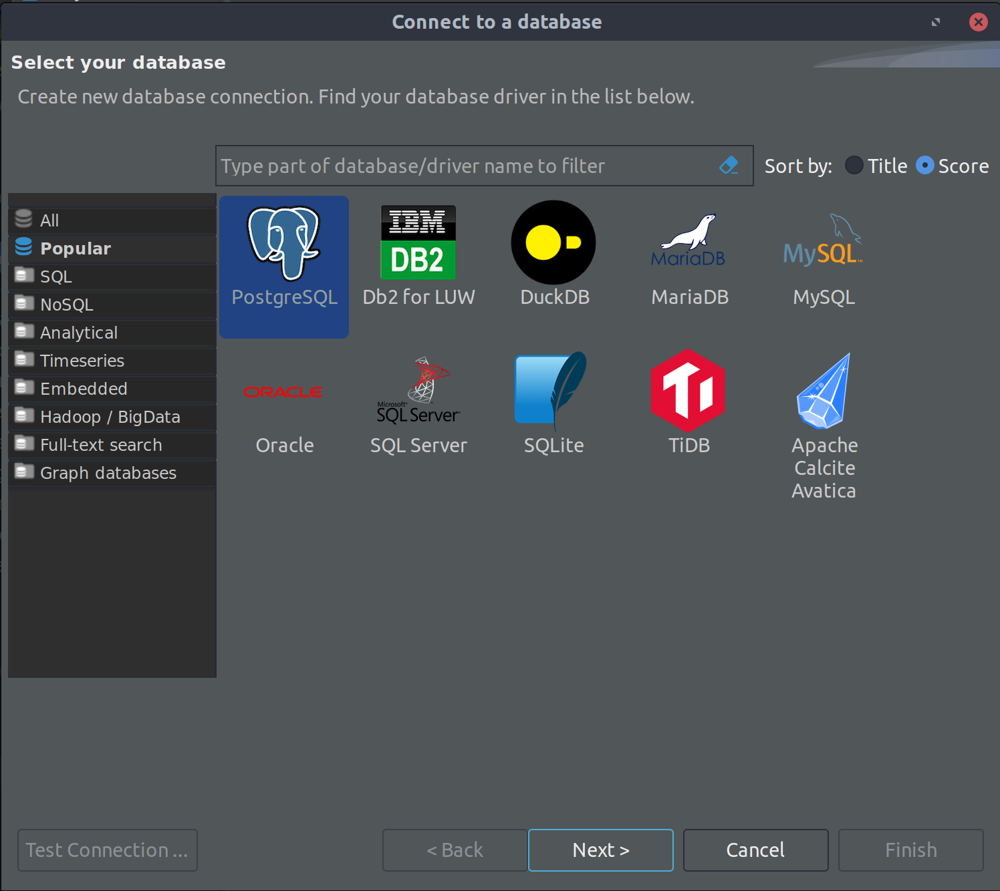
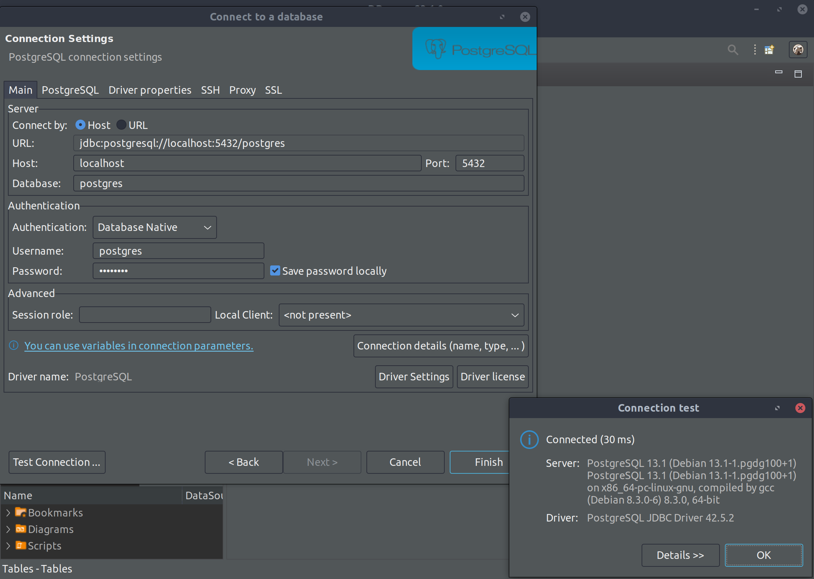
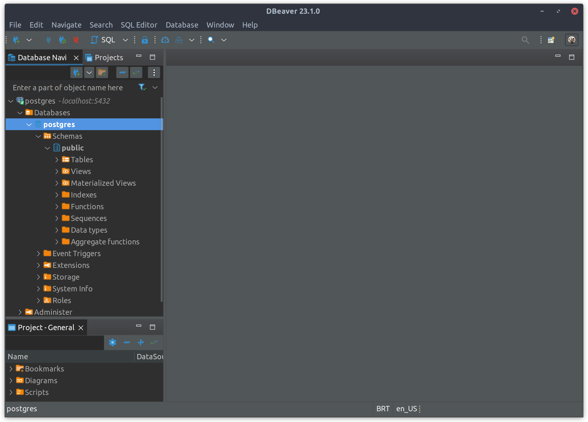
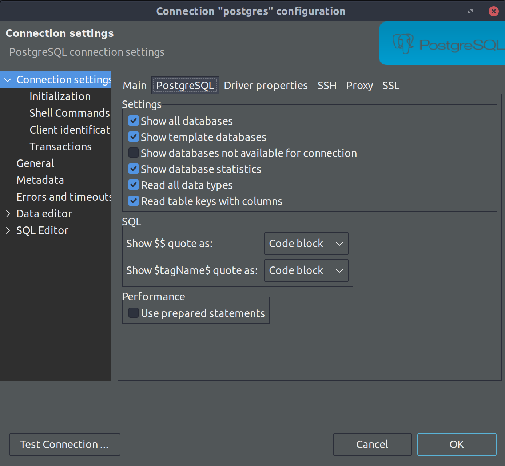

# A POSTGRES (POSTGIS) AUTOMATED DEPLOYMENT

## TABLE OF CONTENTS

[OVERVIEW](#overview)

[PREREQUISITES](#prerequisites)

[USE CASES](#use-cases)

[TESTING CONNECTION](#testing-connection)

## OVERVIEW

The objective of this README.md document file is to provide help on how to run the automated deployment of a simple [local] containerized PostgresSQL DBMS service, as a Proof of Concept (POC), using a Docker Compose yml file.

It is recommended to use a Portainer management UI which allows you to easily build and manage containers your Docker host, available at [Portainer project](https://github.com/rubenschagas/portainer).

Likewise, an automated deployment of users, databases and tables based on Ansible playbooks is available at the [ansibleAutomatedPlaybooks](https://github.com/rubenschagas/ansibleAutomatedPlaybooks) project.

## PREREQUISITES

1. "docker": "24.0.2";
2. "docker compose": "2.18.1";
3. "a postgres dbms client, like DBeaver": ">=23.x";
4. install a postgresql-client-13 locally:

```
 apt-get update \
  && apt-get install -y postgresql-client-13 \
  && apt-get clean \
  && rm -rf /var/lib/apt/lists/*
```

Please see the [Postgis Official Documentation](https://hub.docker.com/r/postgis/postgis).

## USE CASES

```
docker-compose -f docker-compose-postgres.yml pull
docker-compose -f docker-compose-postgres.yml up -d
```

## TESTING CONNECTION

Using a postgres dbms client, like DBeaver, add a PostgresSQL type connection, as follows:








